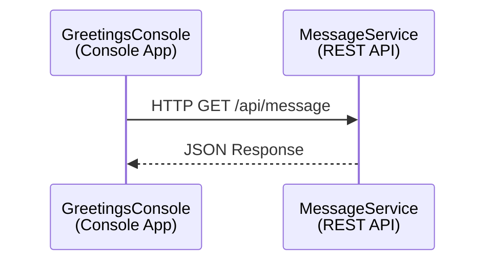
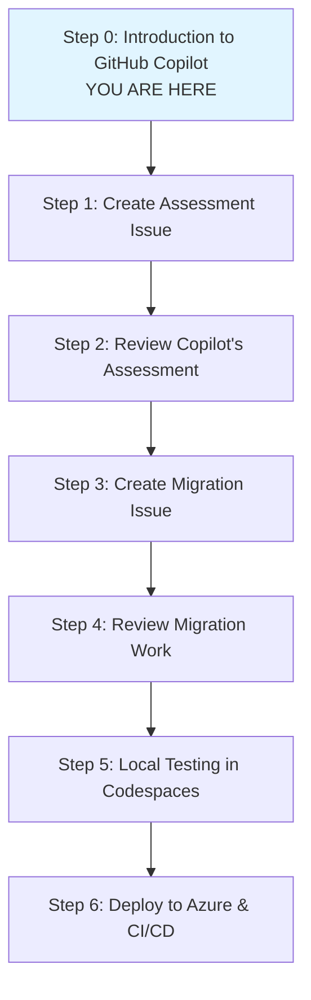

# Step 0: Introduction to GitHub Copilot for Application Modernization

## Welcome to the GitHub Copilot Migration Workshop! 🚀

This workshop demonstrates how to use GitHub Copilot not just as a pair programmer, but as a team member that can handle complete tasks independently.

### Workshop Progress Checklist
- [ ] Read and understand the two ways to use GitHub Copilot
- [ ] Review the current application architecture
- [ ] Understand the workshop flow and objectives

---

## Two Ways to Use GitHub Copilot

### 1. GitHub Copilot as a Pair Programmer (VS Code)

When you use GitHub Copilot in VS Code, it acts as your intelligent coding assistant:

- **Code Completion**: As you type, Copilot suggests entire lines or blocks of code
- **Context-Aware Suggestions**: It understands your codebase and provides relevant recommendations
- **Comment-to-Code**: Write a comment describing what you want, and Copilot generates the implementation
- **Real-time Assistance**: Get instant help with syntax, patterns, and best practices
- **Chat Interface**: Use Copilot Chat to ask questions, explain code, or get refactoring suggestions

**Use Cases:**
- Writing new functions or classes
- Refactoring existing code
- Debugging and fixing issues
- Learning new APIs or frameworks
- Getting code explanations

### 2. GitHub Copilot as a Team Member (Copilot Workspace)

GitHub Copilot can also work as an autonomous team member that you can assign tasks to:

- **Issue Assignment**: Create an issue and assign it to Copilot
- **Independent Work**: Copilot analyzes requirements, plans the solution, and implements it
- **Pull Request Creation**: Copilot creates PRs with the completed work for your review
- **Multi-file Changes**: Handles complex tasks spanning multiple files and directories
- **Best Practices**: Suggests optimal approaches with pros and cons

**Use Cases:**
- Application modernization and migration
- Adding new features
- Setting up CI/CD pipelines
- Creating deployment configurations
- Code refactoring across multiple files

---

## Current Application Overview

You're working with a legacy .NET Framework 4.8.1 application that consists of:

### Architecture

### Components

1. **MessageService** (REST API)
   - ASP.NET Web API 2
   - Returns timestamped greeting messages
   - Runs on http://localhost:5000
   - Swagger documentation available

2. **GreetingsConsole** (Console Application)
   - Calls the MessageService API
   - Displays greeting messages
   - **Scheduled to run every minute** (important for migration planning)

### Current Limitations
- Uses .NET Framework 4.8.1 (Windows-only)
- Requires Windows environment for deployment
- Not cloud-native
- Manual scaling challenges
- Legacy hosting requirements (IIS)

---

## Workshop Objectives

By the end of this workshop, you will:

1. ✅ Learn to use GitHub Copilot as an autonomous team member
2. ✅ Get a modernization assessment from Copilot with recommendations
3. ✅ Have Copilot migrate the application to a modern cloud-native architecture
4. ✅ Test the migrated application locally in GitHub Codespaces
5. ✅ Deploy the application to Azure (optional)
6. ✅ Set up CI/CD for automated deployments (optional)

---

## Workshop Flow

The workshop is divided into the following steps:

---

## Prerequisites Checklist

Before proceeding, ensure you have:

- [ ] Access to this GitHub repository
- [ ] GitHub Copilot enabled for your account
- [ ] Basic understanding of .NET applications
- [ ] Familiarity with Azure (for deployment steps)
- [ ] GitHub Codespaces available (or local development environment)

---

## Next Steps

Once you've completed the checklist above and feel comfortable with the concepts:

➡️ **[Proceed to Step 1: Create Assessment Issue](step-01-create-assessment-issue.md)**

---

## Additional Resources

- [GitHub Copilot Documentation](https://docs.github.com/en/copilot)
- [GitHub Copilot Workspace Guide](https://githubnext.com/projects/copilot-workspace)
- [Azure Migration Guide](https://azure.microsoft.com/en-us/solutions/migration/)
- [.NET Modernization Resources](https://dotnet.microsoft.com/learn/azure)
