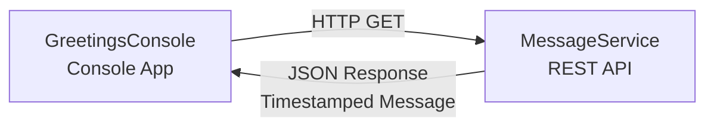

# GitHub Copilot Migration Workshop - Sample Application

This repository contains a sample .NET Framework 4.8.1 application that will be used for the **GitHub Copilot Migration Workshop**. The workshop demonstrates how to use GitHub Copilot to modernize and migrate legacy applications to modern cloud-native architectures.

## Overview

This is a demonstration application consisting of two .NET Framework 4.8.1 projects that work together to showcase REST API communication. This application serves as the starting point for learning how to leverage GitHub Copilot for application modernization and cloud migration.

### Application Components

1. **MessageService** - A REST API service that returns timestamped greeting messages
2. **GreetingsConsole** - A console application that calls the MessageService and displays the results

## Architecture



## Technology Stack

- **.NET Framework 4.8.1** - Windows-based framework
- **ASP.NET Web API 2** - For the REST API (MessageService)
- **Swashbuckle** - API documentation
- **HttpClient** - For REST API consumption
- **Newtonsoft.Json** - JSON serialization

## Prerequisites

- **Windows Operating System** (required for .NET Framework 4.8.1)
- **.NET Framework 4.8.1** - [Download here](https://dotnet.microsoft.com/download/dotnet-framework/net481)
- **Visual Studio 2022** (recommended) or **Visual Studio 2019**
  - Workload: ASP.NET and web development
  - Workload: .NET desktop development

## Getting Started

### Fork the Repository

Before you begin, fork this repository to your own GitHub account:

1. Click the **Fork** button at the top right of this repository page
2. Select your GitHub account as the destination
3. Wait for the fork to complete
4. Clone your forked repository to your local machine:
   ```bash
   git clone https://github.com/YOUR-USERNAME/github-copilot-migration-workshop.git
   ```

## Quick Start with Visual Studio

1. **Open the solution:**
   - Launch Visual Studio 2022
   - Open `MigrationWorkshop.sln`
   - Wait for NuGet packages to restore automatically

2. **Start MessageService:**
   - Right-click on `MessageService` project in Solution Explorer
   - Select "Set as Startup Project"
   - Press `F5` or click "Start" to run the service
   - The service will start in IIS Express
   - Note the URL where the service is running (should be http://localhost:5000)

3. **Run GreetingsConsole:**
   - Ensure MessageService is still running
   - Right-click on `GreetingsConsole` project in Solution Explorer
   - Select "Debug" → "Start New Instance"
   - A console window will open displaying the greeting message

### Alternative: Running Both Projects Simultaneously

1. **Configure multiple startup projects:**
   - Right-click on the Solution in Solution Explorer
   - Select "Properties"
   - Choose "Multiple startup projects"
   - Set both MessageService and GreetingsConsole to "Start"
   - Click OK

2. **Start both projects:**
   - Press `F5` or click "Start"
   - MessageService will start in a web browser
   - GreetingsConsole will open in a console window

## Project Structure

```
github-copilot-migration-workshop/
├── MigrationWorkshop.sln          # Solution file
├── README.md                       # This file
├── packages/                       # NuGet packages (auto-generated)
├── MessageService/                 # REST API Project
│   ├── App_Start/
│   │   ├── WebApiConfig.cs        # Web API configuration
│   │   └── SwaggerConfig.cs       # Swagger configuration
│   ├── Controllers/
│   │   └── MessageController.cs   # API controller
│   ├── Models/
│   │   └── MessageResponse.cs     # Response model
│   ├── Properties/
│   │   └── AssemblyInfo.cs        # Assembly information
│   ├── Global.asax                # Application entry point
│   ├── Global.asax.cs             # Application startup code
│   ├── Web.config                 # Configuration file
│   ├── MessageService.csproj      # Project file
│   ├── packages.config            # NuGet packages
│   └── README.md                  # Service-specific documentation
└── GreetingsConsole/              # Console Application Project
    ├── Models/
    │   └── MessageResponse.cs     # Response model
    ├── Properties/
    │   └── AssemblyInfo.cs        # Assembly information
    ├── Program.cs                 # Main application logic
    ├── App.config                 # Configuration file
    ├── GreetingsConsole.csproj    # Project file
    ├── packages.config            # NuGet packages
    └── README.md                  # Application-specific documentation
```

## Features

### MessageService API
- **Endpoint:** `GET /api/message`
- **Returns:** JSON object with timestamped greeting
- **Swagger UI:** Available at `http://localhost:5000/swagger`
- **Port:** 5000 (configurable in project properties)

### GreetingsConsole Console App
- Connects to MessageService
- Displays formatted greeting message
- Error handling for connection issues
- User-friendly console interface

## Building the Solution

### Build All Projects
In Visual Studio:
1. Select "Build" → "Build Solution" (or press `Ctrl+Shift+B`)
2. Check the Output window for build results

### Clean and Rebuild
1. Select "Build" → "Clean Solution"
2. Select "Build" → "Rebuild Solution"

## Testing the API

### Using Swagger UI
1. Run MessageService
2. Navigate to `http://localhost:5000/swagger`
3. Click on the `/api/message` endpoint
4. Click "Try it out" then "Execute"

### Using a Web Browser
Navigate to:
```
http://localhost:5000/api/message
```

### Using PowerShell
```powershell
Invoke-RestMethod -Uri http://localhost:5000/api/message
```

---

## Next Steps: Migration Workshop

Now that you have the current application running, you're ready to begin the migration workshop!

The migration workshop will guide you through using **GitHub Copilot** to modernize this legacy .NET Framework application and migrate it to a modern cloud-native architecture on Azure.

### Start the Migration

📂 **Go to the [Migration](./Migration) folder** to begin the workshop.

The Migration folder contains step-by-step instructions that will teach you how to:
- Use GitHub Copilot as an autonomous team member
- Assess modernization options for legacy applications
- Implement cloud-native architectures
- Deploy to Azure using modern DevOps practices

**Begin here:** [Migration/README.md](./Migration/README.md)

---

## Naming Conventions

This project follows .NET naming conventions:

- **Solution:** PascalCase - `MigrationWorkshop.sln`
- **Projects:** PascalCase - `MessageService`, `GreetingsConsole`
- **Namespaces:** PascalCase - `MessageService`, `GreetingsConsole.Models`
- **Classes:** PascalCase - `MessageController`, `MessageResponse`
- **Methods:** PascalCase - `GetMessage`
- **Properties:** PascalCase - `Message`, `Timestamp`
- **Variables:** camelCase - `timestamp`, `message`
- **Constants:** PascalCase - `MessageServiceUrl`

## Documentation

Each project includes:
- **XML documentation comments** in source code for IntelliSense support
- **Project-specific README** files with detailed instructions
- **Inline comments** where necessary for clarity

See individual project READMEs for detailed information:
- [MessageService Documentation](MessageService/README.md)
- [GreetingsConsole Documentation](GreetingsConsole/README.md)

## Troubleshooting

### MessageService won't start
- Ensure .NET Framework 4.8.1 is installed
- Check if port 5000 is already in use
- Verify IIS Express is installed with Visual Studio

### NuGet packages not restoring
- Right-click on Solution → "Restore NuGet Packages"
- Check your internet connection

### GreetingsConsole cannot connect
- Ensure MessageService is running first
- Check that MessageService is listening on http://localhost:5000
- Verify no firewall is blocking the connection

### Build errors
- Ensure .NET Framework 4.8.1 SDK is installed
- Clean and rebuild the solution
- Restore NuGet packages

## Notes

- This solution uses **.NET Framework 4.8.1** as the starting point for the migration workshop
- Requires Windows operating system for running the current .NET Framework application
- Best developed and tested using Visual Studio on Windows
- This is a sample application designed for the **GitHub Copilot Migration Workshop**
- After running the application, proceed to the [Migration](./Migration) folder for the workshop instructions

## About This Workshop

This is a demonstration project for the **GitHub Copilot Migration Workshop**. The workshop teaches you how to use GitHub Copilot to modernize legacy applications and migrate them to modern cloud platforms.

To start the workshop, see the [Migration](./Migration) folder.
